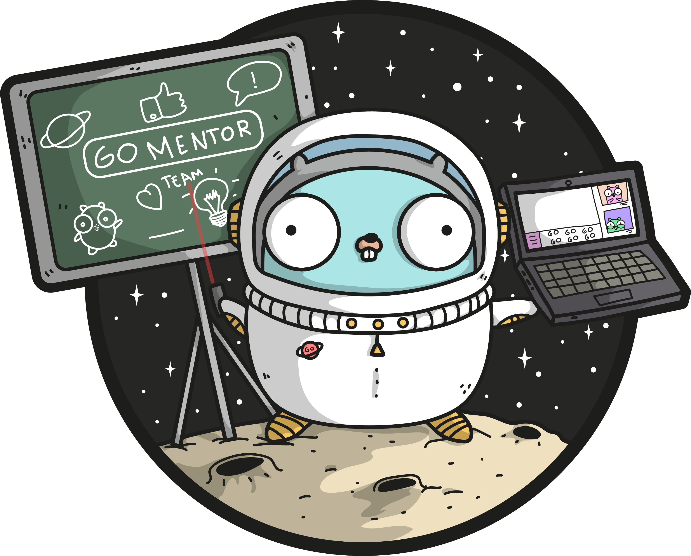

# apod 🌌    

The main idea is to develop REST API service for loading astronomy picture of the day from the APOD API.

## What has been implemented? 🤔

This project is implemented using REST. The service has two endpoints to retrieve pictures and one shudow worker to retrieve a picture of the day every 12 hours. You can the OpenAPI specification [here](./openapiv2/swagger.yaml).

## How to run it? 🤔

Just run the `make local-run` command. This command builds a Docker image with a Go binary inside and starts the container in the docker-compose.

## How to test it? 🤔

If you want to test it, you can find the Postman collection [here](./postman/).

## Thank you! 💟
